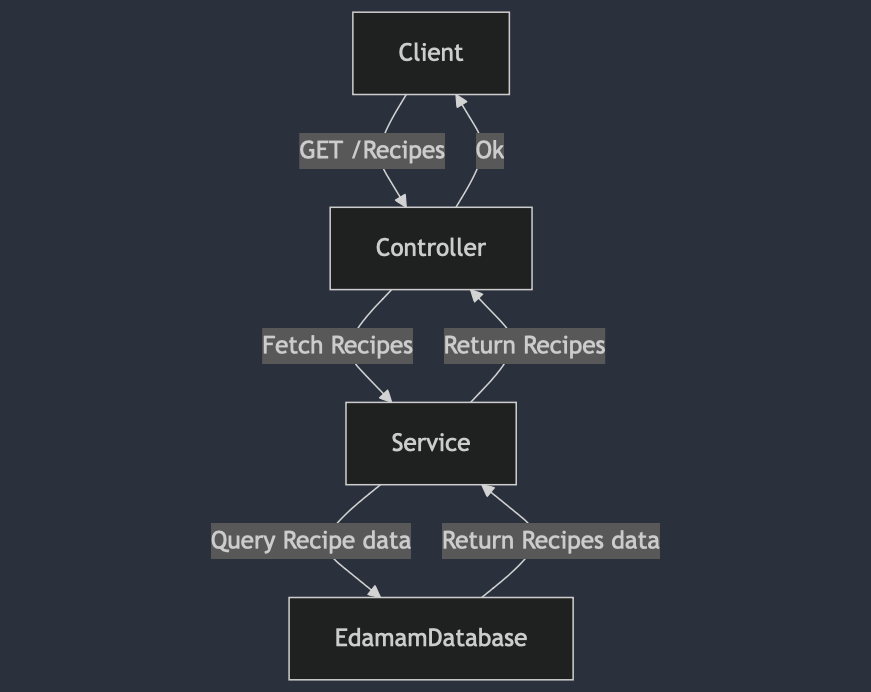

# Meal Recommendation Service

## Overview

This project is a **Meal Recommendation Service** built using **Spring Boot** for the backend and **React** for the frontend. It provides users with list of recipes for given input. The application follows a microservice architecture and is designed to integrate multiple services for data handling, recommendation logic, and user interaction.

## Technologies Used

- **Backend**: Spring Boot (Java)
- **Frontend**: React (JavaScript)
- **API Documentation**: OpenAPI/Swagger
- **Build Tools**: Maven
- **Containerization**: Docker

## Key Features

- RESTful APIs for managing and generating recipes.
- This project uses Spring Cache to handle the caching layer.
- Swagger integration for API documentation.
- Separation of frontend (React) and backend (Spring Boot) services.
- Docker support for easy containerization and deployment.

## Design and Implementation Approach

### 1. **Layered Architecture**

The backend follows a **layered architecture**:
- **Controller Layer**: Manages API endpoints and handles HTTP requests.
- **Service Layer**: Contains business logic for processing user inputs and generating recommendations.


The frontend React application communicates with the backend via REST API calls to retrieve meal recommendations.

### 2. **Design Patterns**

- **Builder Pattern - Creating URLs**: Used in API Call classes to build URL.
- **Template Method Pattern - Handling API Calls**: Applied in making generic API call.We can extend from APICallTemplate.java class for specific API Call.  


1. **User Interaction**:
    - The user requests meal recommendations through the React frontend.
    - The request is sent to the Spring Boot backend.

2. **Backend Process**:
    - The Controller receives the request and forwards it to the Service layer.
    - The Service layer interacts with the Repository to retrieve the relevant data.
    - The recommendation logic processes the data and returns a response.

3. **Frontend Process**:
    - The React frontend processes the response and displays the meal recommendations to the user.

## Flow Diagram

The flow of the application follows this process:


## API Endpoints

The backend exposes the following RESTful API endpoints:

| Method | Endpoint | Description |
|--------|----------|-------------|
| POST    | `/api/recipes`  | Retrieves a list of Recipes|

The APIs are documented using **Swagger**. You can access the Swagger UI at: http://localhost:8080/swagger-ui/index.html


## Installation

1. Clone the Backend repository:

    ```bash
    git clone https://github.com/raodilip/Recipe-Search-Backend.git
    ```

2. Navigate to the project directory:

    ```bash
    cd meal-recommendation-service
    ```
3. **Create application.properties file in src/main/resources**:
```
spring.application.name=meal-recommendation-service
spring.cache.type=simple
edamam.appId=Your API - ID
edamam.appKey=Your API - KEY
springdoc.api-docs.path=/api-docs
springdoc.swagger-ui.path=/swagger-ui.html
logging.level.org.springdoc=DEBUG
springdoc.swagger-ui.enabled=true
springdoc.api-docs.enabled=true
```

4. **Backend (Spring Boot)**:
   - Ensure you have Java 11+ installed.
   - Run the following Maven command to start the backend:

     ```bash
     mvn clean install
     mvn spring-boot:run
     ```


5. **Access the Application**:
   - Frontend: `http://localhost:3000`
   - Backend: `http://localhost:8080`

## Running Tests

To run the tests for the backend, use:

```bash
mvn test
```

## Building Docker Image

```bash
docker build -t <your-docker-name> .
```

## Run Docker Container

```bash
docker run -p 8080:8080 <your-docker-name>

```