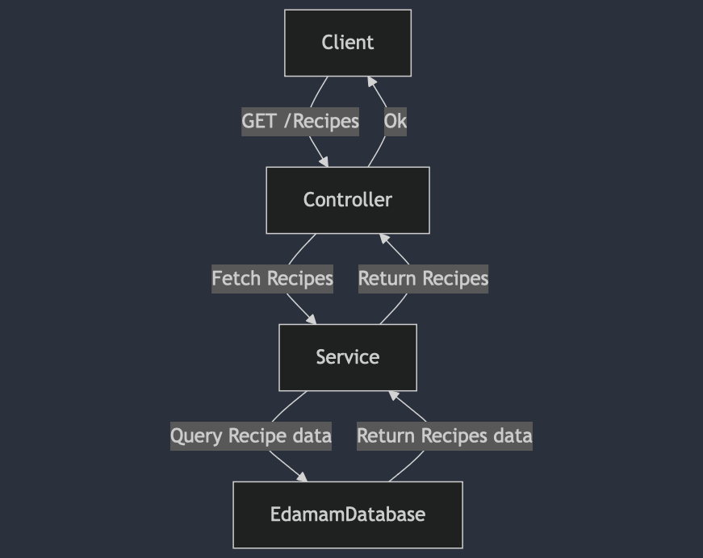

# Recipe Search

## Overview

The **Recipe Search** is a full-stack application built using **Spring Boot** for the backend and **React** for the frontend. This application provides users with a list of recipes based on their input, utilizing a microservice architecture designed for seamless data handling, recommendation logic, and user interaction.

## Project Demo


## Technologies Used

- **Backend**: Spring Boot (Java)
- **Frontend**: React (JavaScript)
- **API Documentation**: OpenAPI/Swagger
- **Build Tools**: Maven
- **Containerization**: Docker

## Key Features

- RESTful APIs for managing and generating recipes.
- Caching support via Spring Cache for enhanced performance.
- Swagger integration for comprehensive API documentation.
- Separation of frontend (React) and backend (Spring Boot) services.
- Docker support for simplified deployment and containerization.

## Design and Implementation Approach

### 1. **Layered Architecture**

The backend follows a **layered architecture**:
- **Controller Layer**: Manages API endpoints and handles HTTP requests.
- **Service Layer**: Contains business logic for processing user inputs and generating recommendations.

### 2. **Design Patterns**

- **Builder Pattern**: Used in API Call classes to construct URLs.
- **Template Method Pattern**: Applied for making generic API calls; extend from `APICallTemplate.java` for specific API calls.

### Application Flow

1. **User Interaction**:
   - The user requests meal recommendations through the React frontend.
   - The request is sent to the Spring Boot backend.

2. **Backend Process**:
   - The Controller receives the request and forwards it to the Service layer.
   - The Service layer interacts with the Repository to retrieve relevant data.
   - The recommendation logic processes the data and returns a response.

3. **Frontend Process**:
   - The React frontend processes the response and displays the meal recommendations to the user.

### Flow Diagram



## API Endpoints

The backend exposes the following RESTful API endpoints:

| Method | Endpoint        | Description                       |
|--------|-----------------|-----------------------------------|
| GET    | `/api/recipes`  | Retrieves a list of recipes      |

The APIs are documented using **Swagger**. You can access the Swagger UI at: [Swagger UI](http://localhost:8080/swagger-ui/index.html).

## Installation

### 1. Clone the Repository

```bash
git clone https://github.com/raodilip/Recipe-Search.git
cd Recipe-Search
```
### 2. Set Up Environment Variables

#### Frontend (React)

1. Create an `.env` file in the root of the frontend directory with the following content:

   ```plaintext
   REACT_APP_RECIPE_ENDPOINT='http://localhost:8080/api/recipes'
   ```

 Here's the content from section 2 onwards formatted correctly in Markdown:


### 2. Set Up Environment Variables

#### Frontend (React)

1. Create an `.env` file in the root of the frontend directory with the following content:

   ```plaintext
   REACT_APP_RECIPE_ENDPOINT='http://localhost:8080/api/recipes'
   ```

2. Navigate to the frontend directory:

   ```bash
   cd frontend
   ```

3. Install the dependencies:

   ```bash
   npm install
   ```

4. Run the React application:

   ```bash
   npm run start
   ```

#### Backend (Spring Boot)

1. Navigate to the backend directory:

   ```bash
   cd backend
   ```

2. Create an `application.properties` file in `src/main/resources` with the following content:

   ```plaintext
   spring.application.name=meal-recommendation-service
   spring.cache.type=simple
   edamam.appId=Your API - ID
   edamam.appKey=Your API - KEY
   springdoc.api-docs.path=/api-docs
   springdoc.swagger-ui.path=/swagger-ui.html
   logging.level.org.springdoc=DEBUG
   springdoc.swagger-ui.enabled=true
   springdoc.api-docs.enabled=true
   ```

3. Ensure you have Java 11+ installed.

4. Run the following Maven command to start the backend:

   ```bash
   mvn clean install
   mvn spring-boot:run
   ```

### Access the Application

- **Frontend**: [http://localhost:3000](http://localhost:3000)
- **Backend**: [http://localhost:8080](http://localhost:8080)

## Running Tests

To run the tests for the backend, use:

```bash
mvn test
```

## Building Docker Image

To build the Docker image, run:

```bash
docker build -t <your-docker-name> .
```

## Run Docker Container

To run the Docker container, execute:

```bash
docker run -p 8080:8080 <your-docker-name>
``` 
